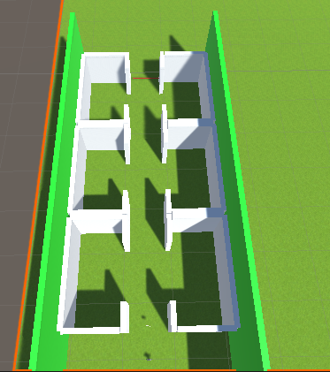
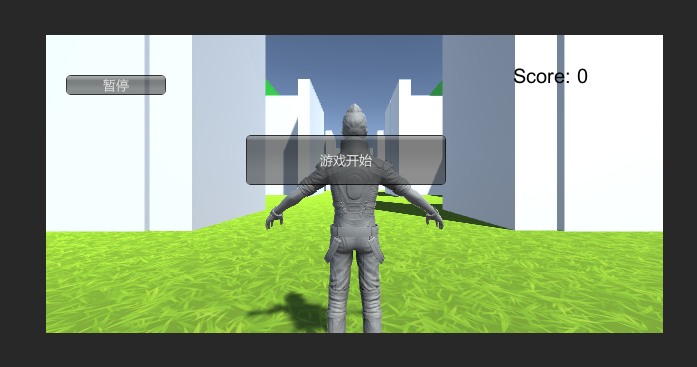
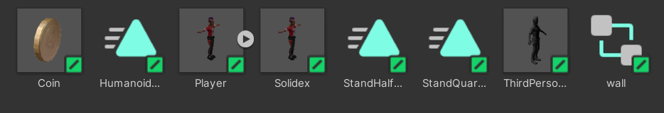

# 巡逻兵游戏
## 一、题目
游戏设计要求：
创建一个地图和若干巡逻兵(使用动画)；

每个巡逻兵走一个3~5个边的凸多边型，位置数据是相对地址。即每次确定下一个目标位置，用自己当前位置为原点计算；

巡逻兵碰撞到障碍物，则会自动选下一个点为目标；

巡逻兵在设定范围内感知到玩家，会自动追击玩家；

失去玩家目标后，继续巡逻；

计分：玩家每次甩掉一个巡逻兵计一分，与巡逻兵碰撞游戏结束；

程序设计要求：

必须使用订阅与发布模式传消息

工厂模式生产巡逻兵
## 二、游戏规则设计
首先，场景设计为一个有六个房间的小地图，如图所示：

出口位置被挡住，只有在玩家获得指定道具（一个金币）时才会打开，成功从出口离开，则胜利。

游戏计分遵循要求，每甩掉一个巡逻兵计一分，为了获得更高的分数，玩家可以在逃出前更长时间逗留。

金币会随机出现在六个房间中的一个中。

而本游戏设计的巡逻兵会随机出现在场景中过道上，她们会以固定方式巡逻，当玩家距离其一定范围内时，巡逻兵会转向玩家并追击，若被巡逻兵触碰则游戏失败。

游戏过程中允许暂停。

游戏开始场景截图如下：


## 三、预制与场景
本游戏场景是直接布置的，预制和动画如下：


我们准备了金币、巡逻兵和玩家（使用的资源），提供了巡逻兵运动所用的animation和animation comtroller。

不过，除了巡逻兵，游戏的各种布置包括主角都是直接放在场景中的。
## 四、代码

### 1. 巡逻兵的组件
我们为主角添加了如下代码，让巡逻兵可以在遇到玩家时转向追击，并判断是否抓住玩家。
```
public class Magnetic : MonoBehaviour
{
    public GameObject play;
    Animator ani;
    Vector3 player;
    int after=0;
    int i=0;
    void FixedUpdate ()
    {
        player=play.transform.position;
        float xx=player.x-this.transform.position.x;
        float zz=player.z-this.transform.position.z;
        ani=GetComponent<Animator>();
        float res=xx*xx+zz*zz;
        if(res<25){
            ani.SetBool("who",true);
            this.transform.LookAt(player);
            after=1;
        }
        else{
            ani.SetBool("who",false);
            if(after==1) {
                Singleton<SSEventManager>.Instance.Escape();
                after=0;
            }
        }
    }
    void OnCollisionEnter(Collision co){
        if(co.gameObject.tag=="Player"){
            Singleton<SSEventManager>.Instance.Gameover();
        }
        else{
            
            this.transform.rotation=Quaternion. Euler(new Vector3(0, 180*i, 0));
            i=1-i;
        }
    }
}
```

### 2. 金币的代码
该部分为金币随机一间屋子（设置位置），也帮助金币判断是否被碰到，如果被玩家获得，则消失并消掉出口处的阻碍物。
```
public class CoinCollision : MonoBehaviour
{
    int a,b;
    public GameObject endline;
    // Start is called before the first frame update
    void Start()
    {
        a=(int)Random.Range(1,3);
        b=(int)Random.Range(1,4);
        this.transform.position=new Vector3(15+(a-1)*20,1,16+21*b);
    }

    // Update is called once per frame
    void Update()
    {
        
    }
    void OnCollisionEnter(Collision co){
        Debug.Log("test");
        if(co.gameObject.tag=="Player"){
            endline.SetActive(false);
            this.transform.gameObject.SetActive(false);
        }
    }
}
```

### 3. 工厂模式
我们使用工厂模式生产巡逻兵，这些巡逻兵会被随机到地图中的过道位置上，并开始巡逻。
```
public class SolidFactory : Singleton<SolidFactory>
{
    public GameObject player;
    List<GameObject> used = new List<GameObject>();
    List<GameObject> free = new List<GameObject>();
    void Start()
    {
        
    }

    // Update is called once per frame
    void Update()
    {
        
    }
     public GameObject getSolid(){
        GameObject a;
        if(free.Count>0){
            a = free[0];
            free.Remove(a);
        }
        else{
           a = Instantiate(Resources.Load("solidex"),
                new Vector3(Random.Range(20,30),0,Random.Range(38,90)), Quaternion.identity, null) as GameObject;
                a.gameObject.tag = "solid";
                a.GetComponent<Magnetic>().play=player;
        }
        used.Add(a);
        return a;
    }
    public void FreeSolid(GameObject b){
        used.Remove(b);
        free.Add(b);
    }
}
```

### 4.订阅与发布模式
订阅与发布模型一共准备了三个功能，分别用来计分、判断游戏是否Game Over以及暂停。
```
public class SSEventManager : MonoBehaviour
{
    public delegate void ScoreEvent();
    public static event ScoreEvent ScoreChange;

    public delegate void GameoverEvent();
    public static event GameoverEvent GameoverChange;

    public delegate void GameStopEvent();
    public static event GameStopEvent GamePauseChange;
    public void Escape(){
        if(ScoreChange!=null){
            ScoreChange();
        }
    }
    public void Gameover(){
        if(GameoverChange!=null){
            GameoverChange();
        }
    }
    public void GamePause(){
        if(GamePauseChange!=null){
            GamePauseChange();
        }
    }
}
```
具体的onable和ondisable则在controller部分实现。

### 5.controller
controller部分的代码，在本部分完成了初始化、查看订阅模式的客户部分代码、生产巡逻兵等功能。

```
public class NewController : MonoBehaviour,ISceneController,IUsersAction
{
    
    public SolidFactory fcc;
    int statue=0;
    int score=0;
    List<GameObject> solider =  new List<GameObject>();
    int snum=0;
    void Start()
    {
        SDirector director = SDirector.getInstance();
        director.currentScenceController = this;
        fcc = Singleton<SolidFactory>.Instance;
        LoadResources();
    }
    public void LoadResources(){
        fcc.player.GetComponent<Animator>().enabled=false;
        fcc.player.GetComponent<UnityStandardAssets.Characters.ThirdPerson.ThirdPersonUserControl>().enabled=false;
    }
    public int StatueChange(int s){
        if(s==1) {
            fcc.player.GetComponent<Animator>().enabled=true;
            fcc.player.GetComponent<UnityStandardAssets.Characters.ThirdPerson.ThirdPersonUserControl>().enabled=true;
        }
        if(s==-1) return statue;
        statue=s;
        return statue;
    }
    public void Pause(){
         Singleton<SSEventManager>.Instance.GamePause();
    }
    public void OnEnable(){
        SSEventManager.ScoreChange+=AddScore;
        SSEventManager.GameoverChange+=GameStop;
        SSEventManager.GamePauseChange+=GamePau;
    }
    public void OnDisable(){
        SSEventManager.ScoreChange-=AddScore;
        SSEventManager.GameoverChange-=GameStop;
        SSEventManager.GamePauseChange-=GamePau;
    }
    void AddScore(){
        score++;
    }
    void GameStop(){
        statue=5;
        fcc.player.GetComponent<Animator>().enabled=false;
        fcc.player.GetComponent<UnityStandardAssets.Characters.ThirdPerson.ThirdPersonUserControl>().enabled=false;
        for(int i=0;i<solider.Count;i++){
            solider[i].GetComponent<Animator>().enabled=false;
            solider[i].GetComponent<Rigidbody>().isKinematic=true;
        }
    }
    void GamePau(){
        if(statue==1){
            fcc.player.GetComponent<Animator>().enabled=false;
            fcc.player.GetComponent<UnityStandardAssets.Characters.ThirdPerson.ThirdPersonUserControl>().enabled=false;
            for(int i=0;i<solider.Count;i++){
                solider[i].GetComponent<Animator>().enabled=false;
                solider[i].GetComponent<Rigidbody>().isKinematic=true;
            }
            statue=2;
        }
        else if(statue==2){
            fcc.player.GetComponent<Animator>().enabled=true;
            fcc.player.GetComponent<UnityStandardAssets.Characters.ThirdPerson.ThirdPersonUserControl>().enabled=true;
            for(int i=0;i<solider.Count;i++){
                solider[i].GetComponent<Animator>().enabled=true;
                solider[i].GetComponent<Rigidbody>().isKinematic=false;
            }
        }
    }
    public int GetScore(){ return score;}
    void Update()
    {
        if(snum<10&&statue==1){
            GameObject a = fcc.getSolid();
            solider.Add(a);
            snum++;
        }
        if(fcc.player.transform.position.z>97){
            Singleton<SSEventManager>.Instance.Gameover();
            statue=4;
        }
    }
}
```
### 6.GUI界面
该部分为用户交互界面，会提供给用户开始和暂停键，其中开始键在点击后消失。同时，也会显示给用户分数和游戏状态（Game Over或You win!!）

```
public class NewGUI : MonoBehaviour
{
    private IUsersAction action;
    int score = 0;
    GUIStyle style,bigstyle;
    string gameMessage = "";
    int statue=0;
    void Start()
    {
        action = SDirector.getInstance().currentScenceController as IUsersAction;
        style = new GUIStyle();
        style.normal.textColor = Color.white;
        style.fontSize = 50;

        bigstyle = new GUIStyle();
        bigstyle.normal.textColor = Color.black;
        bigstyle.fontSize = 20;
    }
    void OnGUI(){
        if(GUI.Button(new Rect(20,40,100,20), "暂停")){
            action.Pause();
        }
        if(statue==0){
            if(GUI.Button(new Rect(200,100,200,50), "游戏开始")){
                statue=1;
                action.StatueChange(statue);
            }
        }
        GUI.Label(new Rect(350, 200, 180, 200), gameMessage,style);
        GUI.Label(new Rect(Screen.width - 150,30,100,50), "Score: " + score, bigstyle);
    }
    // Update is called once per frame
    void Update()
    {
        score=action.GetScore();
        statue=action.StatueChange(-1);
        if(statue==5){
            gameMessage="GameOver";
        }
        if(statue==4){
            gameMessage="You win!!";
        }
    }
}
```
## 五、效果展示
效果视频链接：https://live.csdn.net/v/261920?spm=1001.2014.3001.5501
详细完整代码查看Github中的Assets